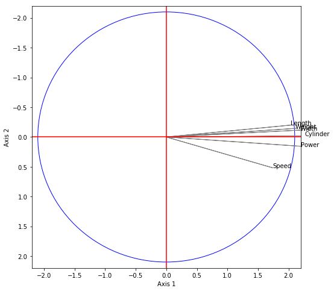
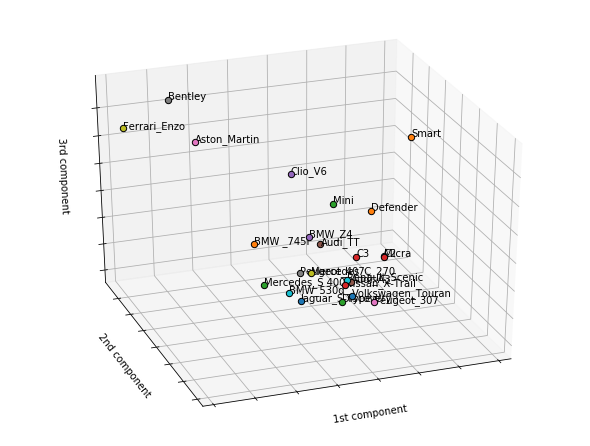

# Gini-PCA

---

### Gini PCA is a robust L1-norm PCA based on the generalized Gini index

In this package, we find:

  * Grid search for detecting and minimizing the influence of outliers 
  * Absolute contributions of the observations 
  * Relative contributions of the observations (equivalent to cos²)
  * Feature importance of each variable (U-statistics test)
  * Outlier detection using Grubbs test 
  * Example on cars data


### Install outlier_utils and iteration-utilities
* torch >= 1.9.0
```python
!pip install outlier_utils
!pip install iteration-utilities
```

### Import Gini PCA


```python
from Gini_PCA import GiniPca
```

### Import data and plot utilities: example on cars data


```python
from Gini_PCA import GiniPca
import torch
import pandas as pd
import numpy as np
import scipy.stats as ss
import matplotlib.pyplot as plt
from sklearn.decomposition import PCA
from sklearn.preprocessing import scale
from mpl_toolkits.mplot3d import Axes3D
from outliers import smirnov_grubbs as grubbs
from iteration_utilities import deepflatten
cars = pd.read_excel("cars.xlsx", index_col=0)
type(cars)
x = torch.DoubleTensor(cars.values)
```

### Run the model by setting your own Gini parameter >=0.1 and != 1

```python
gini_param = 2
model = GiniPca(gini_param)
```


### Rank matrix

```python
model.ranks(x)
```


### Gini mean difference (GMD) matrix

```python
model.gmd(x)
```


### Gini correlation matrix

```python
z = model.scale_gini(x)
print('Gini correlation:', '\n', model.gmd(z))
# or model.gini_correl(x)
```


    Gini correlation: 
     tensor([[1.0000, 0.9643, 0.9025, 0.7347, 0.8840, 0.7317],
            [0.9554, 1.0000, 0.9647, 0.5606, 0.8245, 0.6209],
            [0.8472, 0.9482, 1.0000, 0.4510, 0.6802, 0.5822],
            [0.8111, 0.6868, 0.5071, 1.0000, 0.8299, 0.8179],
            [0.8366, 0.7860, 0.6570, 0.5681, 1.0000, 0.7433],
            [0.8276, 0.7268, 0.6787, 0.8520, 0.8511, 1.0000]], dtype=torch.float64)


### Principal Components

```python
model.project(x)
```


### Find the optimal Gini parameter: Grid search


```python
parameter = model.optimal_gini_param(x)
print(parameter)
```

    tensor(1.4000)
    

### Eigenvalues 


```python
model = GiniPca(gini_param = 1.4)
model.eigen_val(x)
```


### Absolute contributions in %


```python
model.absolute_contrib(x)*100
# Absolute contributions: CTA
U = model.u_stat(x)
U_test = []
for i,value in enumerate(U[0,:]):
    if torch.abs(value) >= 1.96:
        U_test.append(cars.columns[i])
print("Significant variables on axis 1:", U_test)
```


     tensor([[ 1.4321e+01, -4.3653e-01,  5.5242e+00,  4.6318e+00,  1.2128e+00,
              -1.5419e+00],
             [ 3.3132e+01, -9.8679e-02,  3.2156e+00, -1.8731e+00,  3.6428e+00,
               3.1161e-01],
             [ 2.2770e+00,  1.1940e+01,  6.7543e+00, -4.0211e+00,  1.8223e+01,
               3.3657e+00],
             [ 1.1359e+01,  4.6219e-01,  1.8559e+00, -9.3119e+00,  1.9082e-03,
               6.2998e-02],
             [ 1.6150e-02,  4.7812e+00,  1.5500e+01, -3.8179e+00,  4.0791e+00,
               9.6277e-01],
             [-4.5411e-01,  6.1426e-01,  6.9122e+00, -7.6113e+00,  8.1519e+00,
               2.7404e-01],
             [ 2.9533e+00,  2.4478e+00,  2.0845e+01,  1.2843e-01,  5.0505e+00,
               1.0984e+00],
             [ 8.6755e-01, -1.0552e-02,  3.4102e-01,  3.0412e-01, -1.5226e-01,
               8.3536e-01],
             [-8.5698e-02,  3.1131e-01,  1.2388e+00, -1.9017e-01,  5.7092e+00,
               4.0813e+01],
             [ 1.3944e+00,  8.0018e-02,  1.2497e+00,  2.2567e-01, -5.6112e-02,
               9.9347e-02],
             [ 1.1390e+00, -7.6144e-02,  1.1224e+00,  2.4850e-01,  1.5366e+00,
               1.3370e+00],
             [ 4.0577e+00,  1.3656e-02, -6.4956e-02,  5.0605e+00, -1.2223e+00,
               7.8981e-01],
             [ 4.2846e+00, -3.3537e-01,  3.9474e-01, -4.4173e+00, -8.8300e-01,
     ...

     Significant variables on axis 1: ['Cylinder', 'Power', 'Speed', 'Weight', 'Width', 'Length']


### Relative contributions 


```python
model.relative_contrib(x)
```


### Correlations between the variables and the components


```python
model.gini_correl_axis(x)
```


### Feature importance in Gini PCA 

* U-statistics > 2.57: significance of 1% 
* U-statistics > 1.96: significance of 5% 
* U-statistics > 1.65: significance of 10% 


```python
model.u_stat(x)
```

    tensor([[-11.8682, -11.0836,  -9.6512,  -3.9614,  -7.6724,  -6.4632],
            [ -0.1559,  -0.7875,  -1.1760,   1.8336,   0.3508,   1.5903]],
           dtype=torch.float64)

```python
# Absolute contributions: CTA
U = model.u_stat(x)
U_test = []
for i,value in enumerate(U[1,:]):
    if torch.abs(value) >= 1.96:
        U_test.append(cars.columns[i])
print("Significant variables on axis 1:", U_test)
```

    Significant variables on axis 1: []


### Grubbs test


```python
# Grubbs test
components = model.project(x)
components_copy = components.numpy()
outliers_var = []
outliers_gini = []
for i in range (2):
    outliers_var.append(grubbs.max_test_indices(comp_var[:,i], alpha = 0.05))
    outliers_gini.append(grubbs.max_test_indices(components_copy[:,i], alpha = 0.05))
print('Atypical points in standard PCA:', outliers_var)
print('Atypical points in Gini PCA:', outliers_gini)
```


### Circle of correlations


```python
# Circle of correlations
project_var = model.gini_correl_axis(x)

fig = plt.figure(figsize=(8,8))
ax = fig.add_subplot(1, 1, 1)
for i, j, label in zip(project_var[0,:],project_var[1,:], cars.columns):
    plt.text(i, j, label)
    plt.arrow(0,0,i,j,color='gray')
plt.axis((-2.2,2.2,2.2,-2.2))

# Circle
circle = plt.Circle((0,0), radius=2.1, color='blue', fill=False)
ax.add_patch(circle)
plt.axvline(0, color='r') # vertical axis
plt.axhline(0, color='r') # horizontal axis
plt.xlabel("Axis 1")
plt.ylabel("Axis 2")
plt.show()
```



### 3D Plot

```python
# 3D Plot
n, k = x.shape
fig = plt.figure(1, figsize=(8, 6))
ax = Axes3D(fig, elev=-150, azim=110)
F = model.project(x)
for line in range(n):
    ax.scatter(F[line, 0], F[line, 1], F[line, 2], cmap=plt.cm.Set1, edgecolor='k', s=40)
    ax.text(F[line, 0], F[line, 1], F[line, 2], s=cars.index[line], size=10,  color='k') 
ax.set_xlabel("1st component")
ax.w_xaxis.set_ticklabels([])
ax.set_ylabel("2nd component")
ax.w_yaxis.set_ticklabels([])
ax.set_zlabel("3rd component")
ax.w_zaxis.set_ticklabels([])
plt.show
```




### Principal component analysis: A generalized Gini approach

European Journal of Operational Research

[open access to the paper](https://www.sciencedirect.com/science/article/pii/S0377221721000886)

[Stéphane Mussard CV_HAL](https://cv.archives-ouvertes.fr/stephane-mussard)

