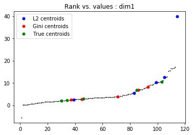

# Gini Kmeans

---

### Gini Kmeans is a robust Kmeans in the Gini pseudo metric space

In this package, we find:

  * Estimation of the centroids (Euclidean and Gini)
  * Estimation of the labels associated to the points


### Import Gini Kmeans


```python
from Gini_Kmeans import GiniKmeans
import numpy as np
import pandas as pd
import seaborn as sns
import scipy.stats as ss
import matplotlib.pyplot as plt
```

### Example with 5 groups on generated data

```python
n = 20
dim = 5

x1 = np.random.rand(n,dim)*20
label1 = np.zeros((n,1))
x2 = np.random.rand(n,dim)*10
x2[19,:] = x2[19,:] +30   # outlier
label2 = np.zeros((n,1))+1
x3 = np.random.rand(n,dim)*5
x3[19,:] = x3[19,:] -10   # outlier
label3 = np.zeros((n,1))+2
x4 = np.random.rand(n,dim)*2.5+1
label4 = np.zeros((n,1))+3
x5 = np.random.rand(n,dim)*4
label5 = np.zeros((n,1))+4

X_train = np.concatenate((x1, x2, x3, x4, x5), axis = 0)
true_labels = np.concatenate((label1, label2, label3, label4, label5), axis = 0)
print(np.mean(x1, axis=0))
print(np.mean(x2, axis=0))
print(np.mean(x3, axis=0))
print(np.mean(x4, axis=0))
print(np.mean(x5, axis=0))
```


### Classification

```python
# Classification
kmeans = GiniKmeans(n_clusters=5, max_iter=300)
center = kmeans.fit(X_train)              # fit with L2 metric
center_gini = kmeans.fit_gini(X_train)    # fit with Gini distance
```

### Results

```python
class_centers, classification = kmeans.evaluate(X_train)
print('Centroids Euclidean:', class_centers)
print('Labels Euclidean:', classification)
class_centers_G, classification_gini = kmeans.evaluate_gini(X_train)
print('Centroids Gini:', class_centers_G)
print('Labels Gini:', classification_gini)
print('True labels: ', true_labels.T)
```

    Centroids Euclidean: [array([39.85498758, 34.12575104, 34.0506426 , 30.62152107, 35.50554709]), array([10.24946137,  9.20304328,  7.64725968, 11.41830831,  9.36041333]), array([12.50657308, 12.57816085, 14.70224492, 13.60119868, 15.12153036]), array([5.454187  , 5.59145229, 5.69607783, 4.51612812, 6.50524734]), array([2.41853647, 2.21361928, 2.35333839, 2.18280964, 2.04857227])]
    
    Labels Euclidean: [2, 1, 1, 2, 1, 1, 1, 2, 1, 2, 2, 1, 1, 1, 4, 1, 1, 1, 1, 1, 3, 3, 3, 4, 3, 3, 3, 3, 4, 3, 4, 3, 3, 3, 3, 3, 3, 3, 4, 0, 4, 4, 4, 4, 4, 4, 4, 4, 4, 4, 4, 4, 4, 4, 4, 4, 4, 4, 4, 4, 4, 4, 4, 4, 4, 4, 4, 4, 4, 4, 4, 4, 4, 4, 4, 4, 4, 4, 4, 4, 4, 4, 4, 4, 4, 4, 4, 4, 4, 4, 4, 4, 4, 4, 4, 4, 4, 4, 4, 4]
    
    Centroids Gini: [array([2.36224341, 5.70661292, 2.9112268 , 7.71565253, 6.67189509]), array([8.18541951, 3.74078646, 5.89316826, 4.28291472, 7.17669755]), array([3.87787505, 2.54225311, 3.7897634 , 5.46917821, 1.67526835]), array([2.77859254, 5.14039559, 5.56789147, 3.16256979, 4.3344691 ]), array([6.80035288, 7.15195653, 3.11414789, 3.90645867, 4.66795346])]
    
    Labels Gini: [3, 2, 1, 3, 0, 1, 1, 2, 0, 2, 1, 4, 0, 2, 4, 4, 3, 4, 3, 4, 1, 2, 3, 0, 3, 4, 0, 4, 4, 0, 3, 1, 1, 1, 0, 3, 1, 2, 2, 1, 1, 3, 1, 2, 4, 3, 1, 0, 4, 0, 2, 2, 2, 0, 1, 1, 1, 3, 1, 2, 2, 2, 4, 3, 0, 2, 3, 3, 3, 0, 3, 1, 1, 2, 1, 2, 1, 3, 3, 4, 3, 4, 2, 4, 1, 2, 2, 1, 2, 2, 3, 1, 3, 3, 3, 2, 3, 2, 0, 3]
    
    True labels:  [[0. 0. 0. 0. 0. 0. 0. 0. 0. 0. 0. 0. 0. 0. 0. 0. 0. 0. 0. 0. 1. 1. 1. 1.
      1. 1. 1. 1. 1. 1. 1. 1. 1. 1. 1. 1. 1. 1. 1. 1. 2. 2. 2. 2. 2. 2. 2. 2.
      2. 2. 2. 2. 2. 2. 2. 2. 2. 2. 2. 2. 3. 3. 3. 3. 3. 3. 3. 3. 3. 3. 3. 3.
      3. 3. 3. 3. 3. 3. 3. 3. 4. 4. 4. 4. 4. 4. 4. 4. 4. 4. 4. 4. 4. 4. 4. 4.
      4. 4. 4. 4.]]

### Graph

```python
X_all = np.concatenate((X_train, center, center_gini), axis=0) 
rank_all = np.zeros((X_all.shape[0], X_all.shape[1]))
for i in range(X_all.shape[1]):
    rank_all[:,i] = ss.rankdata(X_all[:,i], method='average')

centroid_true = np.concatenate((np.mean(x1, axis=0),np.mean(x2, axis=0),np.mean(x3, axis=0),
                np.mean(x4, axis=0),np.mean(x5, axis=0)), axis=0)
centroid_true = np.reshape(centroid_true,(5,dim))
X_all = np.concatenate((X_train, center, center_gini, centroid_true), axis=0) 
rank_all = np.zeros((X_all.shape[0], X_all.shape[1]))
for i in range(X_all.shape[1]):
    rank_all[:,i] = ss.rankdata(X_all[:,i], method='average')

plt.plot([x for x in rank_all[:,0]],
                [y for y in X_all[:,0]],
                'k+',markersize=2)
plt.plot([x for x in rank_all[100:105,0]],
                [y for y in X_all[100:105,0]],
                'b.',label='L2 centroids', markersize=10)
plt.plot([x for x in rank_all[105:110,0]],
                [y for y in X_all[105:110,0]],
                'r.',label='Gini centroids', markersize=10)
plt.plot([x for x in rank_all[110:115,0]],
                [y for y in X_all[110:115,0]],
                'g.',label='True centroids', markersize=10)
plt.legend(loc="best")
plt.title("Rank vs. values : dim1")
plt.show()
```




