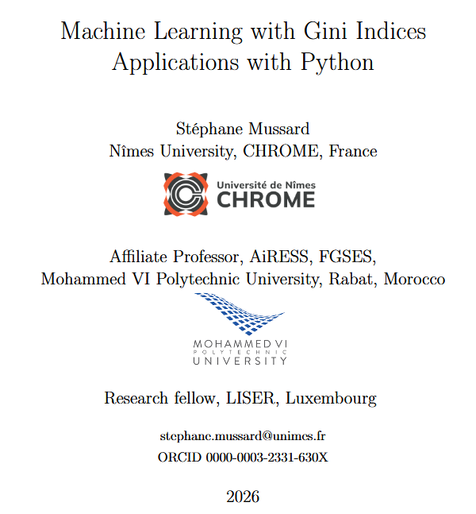

# Machine Learning with Gini Indices $-$ Applications with Python

**Author:** Stéphane Mussard  
Nîmes University (CHROME), France  
Affiliate Professor, Mohammed VI Polytechnic University  
Research Fellow, LISER Luxembourg  
[🌐 Visit my webpage](https://sites.google.com/view/cv-stphane-mussard/accueil)

---

## 📖 Overview

This book explores the use of **Gini indices** as a central tool in **machine learning and data analysis**. Traditionally used to measure inequality and dispersion, Gini-based methods are extended here to provide a powerful alternative to variance-based approaches.

The book introduces a **robust, non-Euclidean framework** for data analysis, with applications in both **supervised** and **unsupervised learning**, along with practical **Python implementations** in every chapter.

---

## 🎯 Objectives

- Present the theoretical foundations of **Gini indices and Gini Mean Difference (GMD)**
- Show how Gini-based methods can replace or complement classical variance-based techniques
- Develop **robust machine learning algorithms** less sensitive to outliers
- Provide **hands-on Python implementations** for all methods

---

## 👥 Target Audience

This book is intended for:

- Students in **data science, statistics, and econometrics**
- Researchers and practitioners looking for alternatives to classical methods (OLS, PCA, etc.)

---

## 🧠 Key Features

- Combines **theory and practice**
- Focus on **robust statistics** and heavy-tailed distributions
- Covers both:
  - Supervised learning (regression & classification)
  - Unsupervised learning (clustering & PCA)
- Includes **complete Python code** for reproducibility

---

## 📚 Contents

### Part I — Getting Started
- Python installation and environment setup

### Part II — Supervised Learning: Gini Regressions
- Gini indices and co-Gini operators
- Simple and multiple Gini regressions
- Panel data models
- Gini-PLS regression

### Part III — Supervised Learning: Classification
- Gini Discriminant Analysis (GDA)
- Gini-kNN algorithms

### Part IV — Unsupervised Learning
- Gini PCA (G2PCA)
- Gini clustering methods
- α-Gini decompositions

---

## 💻 Python & Code

All implementations are provided in Python and can be reused under the MIT license:
- Jupyter notebooks
- Reproducible experiments
- Real datasets and simulations

---

## ⚙️ Requirements

- Python ≥ 3.11
- Recommended tools:
  - VS Code
  - Jupyter Notebook

Main libraries:
- numpy
- scikit-learn
- torch
- mlxtend
- openpyxl

---

## 🚀 Getting Started

```bash
git clone https://github.com/mussard974/Gini-Book-.git
cd Gini-Book
python -m venv gini_env
source gini_env/bin/activate   # or .\Scripts\activate on Windows
pip install -r requirements.txt
```


---

## 📜 License

The Python code in this project is distributed under the **MIT License**, provided that the book is cited.

---

## 📩 Contact

Stéphane Mussard  
📧 stephane.mussard@unimes.fr  

---

